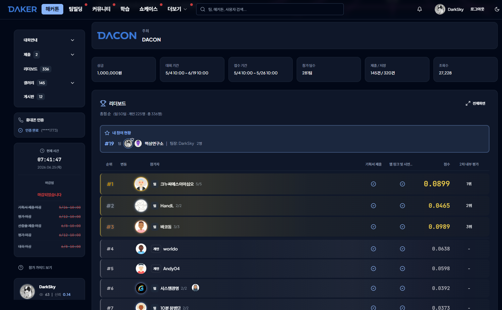

# 대회 정보 — Daker 웹 미니게임 챌린지

> 출처: `docs/ref_user/대회 소개.txt` + https://daker.ai/public/hackathons/monthly-hackathon-web-minigame-challenge

---

## 개요

| 항목 | 내용 |
|------|------|
| 대회명 | Monthly Hackathon — Web Minigame Challenge |
| 플랫폼 | Daker (DACON) |
| 형태 | 웹 기반 미니게임 개발 챌린지 (바이브 코딩 활용) |
| 장르 제한 | 없음 (자유 기획) |
| 플레이 환경 | 별도 설치 없이 브라우저에서 즉시 실행 |

---

## 제출 마감일

| 제출물 | 마감 |
|--------|------|
| 기획서 (PDF) | **2026-05-26 오전 10:00** |
| 최종산출물 | **2026-06-08 오전 10:00** |

---

## 평가 방식

### 1차 평가 — 대중 투표 (상위 10팀 선발)

| 유권자 | 가중치 |
|--------|--------|
| 제출팀 | 60% |
| 참가팀 | 20% |
| 대중 | 20% |

동점 처리: 참가팀 투표 점수 높은 팀 → 최초 업로드 시간 빠른 팀 순

### 2차 평가 — 내부 심사위원 (최종 순위 결정, 총 100점)

| 평가 항목 | 세부 기준 | 배점 |
|-----------|-----------|------|
| 참신성 | 독창성, 차별성, 새로운 경험 제시 | 20점 |
| 완성도 및 안정성 | 오류 없이 정상 실행되며 주요 기능이 문제없이 동작하는가 | 25점 |
| 사용성 및 UI/UX | 조작 방법의 직관성, 화면 구성의 이해 용이성, 안내의 명확성 | 20점 |
| 기획·구현 완성도 | 기획 의도와 실제 구현 결과의 일관성, 핵심 구조 전달력, 플레이 흐름의 적절성 | 20점 |
| 재미 및 몰입도 | 10분 이내 핵심 재미 전달, 반복 플레이 유도, 흥미 지속성, 체류시간 유발 | 15점 |

---

## 제출물 요건

### 기획서 (05/26 마감)
- 형식: PDF
- 포함 내용: 게임 개요, 핵심 규칙, 플레이 방식, 주요 재미 요소, 차별화 포인트, 화면 구성, 확장 아이디어

### 최종산출물 (06/08 마감)
- (필수) 배포 URL — 외부에서 접속 가능, 심사 기간 내 유지
- (필수) GitHub 저장소 링크
- (필수) 시연 영상 유튜브 링크 — 시작화면, 핵심 플레이, 핵심 시스템, 종료화면 포함

플레이 조건:
- 별도 회원가입·유료 결제 없이 심사 가능
- 주요 브라우저에서 정상 실행

---

## 금지 사항

### 금지 콘텐츠
- 사행성 유도
- 불법 행위 조장·미화
- 데이팅/소개팅/만남 주선 성격
- 과도한 폭력성·선정성·혐오

### 수익 연동 금지
- 결제 시스템 연동
- 광고 연동
- 외부 수익화 구조

---

## 개발·배포 규칙

- 배포 URL은 외부 접속 가능, 심사 기간 내 유지
- 바이브 코딩 툴 활용 필수
- 외부 API 사용 시 심사자가 별도 키 없이 확인 가능해야 함

---

## 공정성·저작권

- 코드, 이미지, 폰트, 아이콘 등 저작권·라이선스 준수 필수
- 타인 결과물 무단 복제·도용 시 실격
- 생성형 AI 도구 사용 허용
- 팀 내 역할 분업 자유

---

## 우리 프로젝트 대응 전략

| 평가 항목 | 배점 | k-stock-merchant 대응 |
|-----------|------|----------------------|
| **참신성** | 20점 | 한국 실제 종목·ETF + 뉴스 이벤트 기반 주가 변동 → 친숙한 소재를 게임화한 차별성 |
| **완성도·안정성** | 25점 | WBS 150개 태스크 100%, Vitest 55+ 테스트, 5회 완주 플레이테스트, 4종 브라우저 호환 |
| **사용성·UI/UX** | 20점 | 튜토리얼 없이 즉시 플레이 가능, 매수/매도 단일 클릭, Tailwind 반응형 |
| **기획·구현 완성도** | 20점 | 50라운드 구조로 플레이 흐름 명확, 시작→게임→결과 세 화면 일관성, PRD 기반 구현 |
| **재미·몰입도** | 15점 | 15~20분 완료, 랭킹 경쟁으로 반복 플레이 유도, 뉴스 이벤트로 서사 긴장감 유지 |

---

## 심사 유의사항

- 심사는 배포 URL 기준
- 확인 어려운 기능은 심사 제외 가능
- 운영진 추가 안내 시 공지 우선 적용

---

## 최종 결과 (2026-06-25)

| 항목 | 내용 |
|------|------|
| 최종 순위 | **336명 중 19위** (총 336명 — 개인 225명 + 팀 50팀) |
| 참가 팀 | 떡상연구소 (팀장: DarkSky, 2인) |
| 평가 단계 | 1차 평가(대중 투표 리더보드) 기준 순위 — 상위 10팀 대상 2차 내부 심사위원 평가에는 진출하지 못함 |
| 점수 | 비공개(리더보드 화면에 미표시, 별도 확인 안 함) |

> 1차 평가 가중치(제출팀 60% + 참가팀 20% + 대중 20%) 종합 점수 기준 전체 336명 중 19위로 마감. 기획서·최종산출물 제출은 모두 마감 기한 내 완료.

